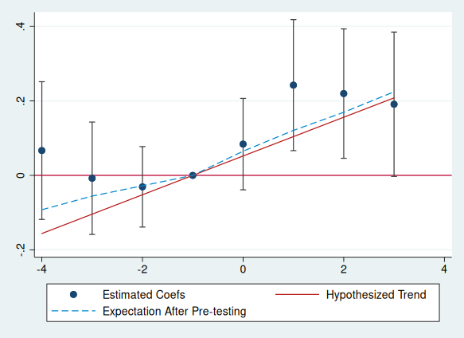
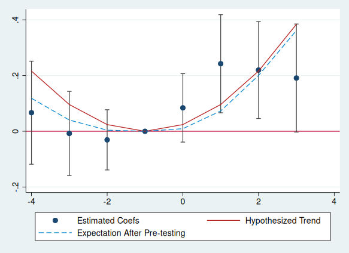

PreTrends
=========

The `pretrends` package provides tools for power calculations for
pre-trends tests, and visualization of possible violations of parallel
trends. Calculations are based on [Roth (2022)](https://jonathandroth.github.io/assets/files/roth_pretrends_testing.pdf).
This is the Stata version of the [R package of the same name](https://github.com/jonathandroth/pretrends).
(Please cite the paper if you enjoy the package!)

If you’re not an R or Stata user, you may also be interested in the associated
[Shiny app](https://github.com/jonathandroth/PretrendsPower).

`version 0.4.2 06Oct2023` | [Installation](#installation) | [Application](#application-to-he-and-wang-2017)

## Installation

The package may be installed by using `net install`:

```stata
local github https://raw.githubusercontent.com
net install pretrends, from(`github'/mcaceresb/stata-pretrends/main) replace
```

You can also clone or download the code manually, e.g. to
`stata-pretrends-main`, and install from a local folder:

```stata
cap noi net uninstall pretrends
net install pretrends, from(`c(pwd)'/stata-pretrends-main)
```

## Application to He and Wang (2017)

We illustrate how to use the package with an application to [He and Wang
(2017)](https://www.aeaweb.org/articles?id=10.1257/app.20160079). The
analysis will be based on the event-study in Figure 2C, which looks like
this:


### Load the example data

We first load the dataset used by He and Wang. 

```stata
use "https://media.githubusercontent.com/media/mcaceresb/stata-pretrends/main/data/workfile_AEJ.dta", clear
```

We then run their regression specification. 

```stata
reghdfe l_poor_reg_rate Lead_D4_plus Lead_D3 Lead_D2 D0 Lag_D1 Lag_D2 Lag_D3_plus, absorb(v_id year) cluster(v_id)
```

which yields the following results

```stata
             |               Robust
l_poor_reg~e | Coefficient  std. err.      t    P>|t|     [95% conf. interval]
-------------+----------------------------------------------------------------
Lead_D4_plus |   .0667032   .0897108     0.74   0.458    -.1099686    .2433749
     Lead_D3 |  -.0077018   .0732436    -0.11   0.916     -.151944    .1365404
     Lead_D2 |  -.0307691   .0523996    -0.59   0.558    -.1339621     .072424
          D0 |   .0840307   .0595518     1.41   0.159    -.0332475    .2013088
      Lag_D1 |   .2424418   .0853721     2.84   0.005     .0743146    .4105691
      Lag_D2 |    .219879    .084391     2.61   0.010     .0536838    .3860741
 Lag_D3_plus |   .1910925   .0940472     2.03   0.043     .0058809    .3763042
       _cons |   1.478639   .0771617    19.16   0.000      1.32668    1.630597

```

In this case, these coefficients come from a two-way fixed effects regression using `reghdfe`. However, the `pretrends` package will work with any package that produces an event-study from any
asymptotically normal estimator, including
[Callaway and Sant’Anna (2020)](https://www.sciencedirect.com/science/article/pii/S0304407620303948?dgcid=author)
and [Sun and Abraham (2020)](https://www.sciencedirect.com/science/article/abs/pii/S030440762030378X), so long as the resulting estimates and coefficients are saved in `e(b)` and `e(V)`. If one is using a command that does not export an `e(b)` and `e(V)`, one can instead provide the coefficients and covariance matrix directly via the `beta()` and `vcov()` options.


### Using the package


The package has two subcommands:

1. The `power` sub-command calculates the slope of a linear violation
  of parallel trends that a pre-trends test would detect a specified
  fraction of the time. (By detect, we mean that there is any significant
  pre-treatment coefficient.)

2. Alternatively, the user can specify a hypothesized violations of parallel trends&mdash;the package then creates a plot to visualize
  the results, and reports various statistics related to the hypothesized difference in trend. The user can specify a hypothesized linear pre-trend via the `slope()`
  option, or provide an arbitrary violation of parallel trends via the `delta()` option. 

Let's illustrate the first use case:

```stata
pretrends power 0.5, pre(1/3) post(4/7)

* Slope for 50% power =  .0494932

return list
* scalars:
*               r(slope) =  .0494932155202119
*               r(Power) =  .5
```

In the command above, the option `pre(1/3)` tells the package that the pre-treatment event-study coefficients are in positions 1 through 3 in our regression results. (The package assumes that the period before the event-study is normalized to zero and omitted from the regression.) Likewise, the option `post(4/7)` tells the package that the post-treatment coefficients are in positions 4 through 7. The results of the command tells us that if there was a linear violation of parallel trends with slope 0.049, then we would have 50% power to detect it (where we say it's "detected" if there is a significant pre-trend coefficient). If we want wanted a different power threshold, say 80%, we would change `power 0.5` to `power 0.8` in the command above.  


Next, we illustrate how to visualize violations of parallel trends using the package's second subcommand. For simplicitly, lets visualize the linear trend against which pre-tests have 50 percent power that we just calculated. This is just for illustration—you can visualize any violation that you want, and should choose an economically relevant one. To do this, we run the command:

```stata
matrix sigma = e(V)
matrix beta  = e(b)
matrix beta  = beta[., 1..7]
matrix sigma = sigma[1..7, 1..7]
pretrends, numpre(3) b(beta) v(sigma) slope(`r(slope)')
```



This tells Stata to visualize a linear violation of parallel trends with slope `r(slope)`, i.e. the value calculated by the previous command (0.049). If you wanted to visualize a linear violation with slope 5, you'd just specify `slope(5)`. (Note when specifying `numpre()` the vector `b()` and the matrix `v()` must only contain the relevant coefficients.) The resulting plot super-imposes the conjectured linear violation of parallel trends on the event-plot in red. It also shows in dashed blue what we'd expect the coefficients to look like on average *conditional on not finding a significant pre-trend* if in fact that truth was the hypothesized red line. In the plot above, both the red line and blue line are contained within all of the confidence intervals (with the exception of one pre-period for the red line), so the hypothesized trend seems somewhat plausible. 


Note that to create the plot above, the `coefplot` package is required; if the coefplot package is not
installed or not available, the user can add option `nocoefplot` to
skip the visualization. In either case the event study data is saved in
`r()`, along several useful statistics about the power of the pre-test
against the hypothesized trend.

```stata
* data for visualization
matlist r(results)
*          r1 |        -4   .0667032  -.1091268   .2425331  -.1484796   -.087755 
*          r2 |        -3  -.0077018  -.1512567   .1358531  -.0989864   -.052812 
*          r3 |        -2  -.0307691  -.1334704   .0719323  -.0494932  -.0265324 
*          r4 |        -1          0          0          0          0          0 
*          r5 |         0   .0840307  -.0326887     .20075   .0494932   .0617067 
*          r6 |         1   .2424418   .0751157    .409768   .0989864   .1148959 
*          r7 |         2    .219879   .0544757   .3852823   .1484796   .1611171 
*          r8 |         3   .1910925   .0067634   .3754217   .1979729   .2134771 


return list
* scalars:
*               r(LR) =  .1016996725963556
*               r(Bayes) =  .5690176868657252
*               r(Power) =  .5000000000010103
*               r(slope) =  .0494932155202119
*
* macros:
*    r(PreTrendsResults) : "PreTrendsResults"
*
* matrices:
*             r(results) :  8 x 6
*               r(delta) :  1 x 8
```

An explanation of the returned results is as follows: 

- **r(results)** The data used to make the event plot. Note the column
  `meanAfterPretesting`, which is also plotted, shows the expected value
  of the coefficients conditional on passing the pre-test under the
  hypothesized trend (i.e. what's shown in the blue dashed line).

- **r(Power)** The probability that we would find a significant pre-trend
  under the hypothesized pre-trend. (This is 0.50, up to numerical
  precision error, by construction in our example). If you hypothesize a different trend, it may be something different.

- **r(BF)** (Bayes Factor) The ratio of the probability of "passing" the
  pre-test under the hypothesized trend relative to under parallel
  trends. Here, the probability of passing the pre-test under the hypothesized trend is about half as likely (56%) as it is under parallel trends.

- **r(LR)** (Likelihood Ratio) The ratio of the likelihood of the observed pre-treatment
  coefficients under the hypothesized trend relative to under parallel
  trends. Here, the realization of the pre-trends is about 1/10th as likely under the hypothesized trend as under parallel trends.


Last, although our example has focused on a linear violation of parallel
trends, the package allows the user to input an arbitrary non-linear
hypothesized trend. For instance, here is the event-plot and power
analysis from a quadratic trend.

```stata
mata st_matrix("deltaquad", 0.024 * ((-4::3) :- (-1)):^2)
pretrends, time(-4(1)3) ref(-1) deltatrue(deltaquad) coefplot
```



```stata
matlist r(results)
*              |         t    betahat         lb         ub  deltatrue  meanAft~g
* -------------+------------------------------------------------------------------
*          r1 |        -4   .0667032  -.1091268   .2425331       .216   .1157555 
*          r2 |        -3  -.0077018  -.1512567   .1358531       .096   .0391983 
*          r3 |        -2  -.0307691  -.1334704   .0719323       .024    .003749 
*          r4 |        -1          0          0          0          0          0 
*          r5 |         0   .0840307  -.0326887     .20075       .024   .0089854 
*          r6 |         1   .2424418   .0751157    .409768       .096   .0723966 
*          r7 |         2    .219879   .0544757   .3852823       .216   .2000759 
*          r8 |         3   .1910925   .0067634   .3754217       .384   .3612036 


return list
* scalars:
*			   r(LR)    =  .3962795305253372
*              r(Bayes) =  .3384376031301103
*              r(Power) =  .7026124047271576
*
* macros:
*    r(PreTrendsResults) : "PreTrendsResults"
*
* matrices:
*             r(results) :  8 x 6
*               r(delta) :  1 x 8
```

(Note when specifying `time()` and `ref()'` by default the vector `b()` and the matrix `v()` must start with the relevant coefficients. The number of pre-period  is taken to be the number of entries in the time vector strictly smaller than `ref()`, and the number of post-periods the number of entries strictly larger. `time()` and `ref()` may be combined with `pre()` and `post()`; `numpre()` may not be combined with either.)
